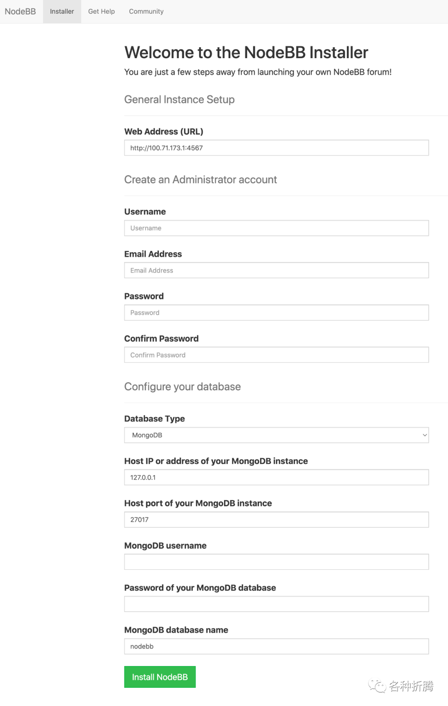
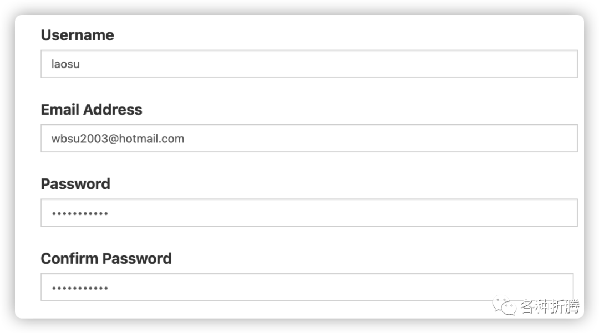
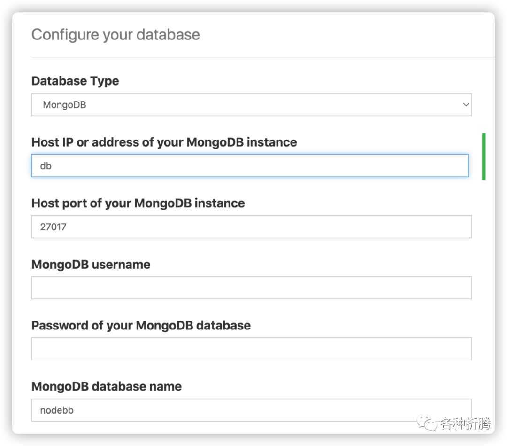
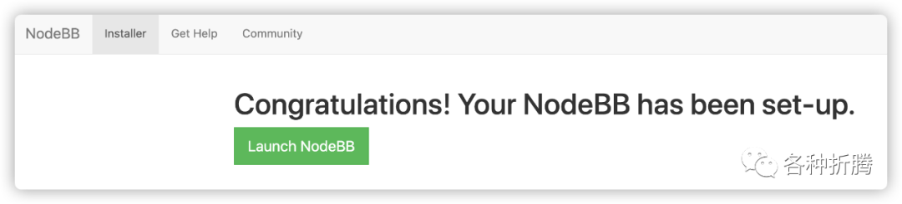

## 使用docker 安装mogodb和NodeBB

用 docker-compose 安装，将下面的内容保存为 docker-compose.yml 文件

* 注意，mogodb用的是4.4.4版本，5以上有CPU的指令问题
* WARNING: MongoDB 5.0+ requires a CPU with AVX support, and your current syst

``` shell
# 新建文件夹 nodebb 和 子目录
mkdir -p /volume2/docker/nodebb/{mongo,uploads}

# 进入 nodebb 目录
cd /volume2/docker/nodebb

# 修改目录权限
chmod 777 uploads/

# 将 docker-compose.yml 放入当前目录

# 一键启动
docker-compose up -d

```

* 注意提前安装好ngxin, 并且设置好代理4567端口  
* 创建好两个容器之后，还要进入mongodb的容器，创建 用户名为 root, 密码 123456  数据库 nodebb
``` shell
# 进入mongo shell
mongo

# 进入admin数据库
use admin

db.createUser({user:'root',pwd:'123456',roles:[{role:'root',db:'nodebb'}]})

```

``` shell
* iptables failed: iptables --wait -t nat -A DOCKER -p tcp -d 0/0 --dport 1433 -j DNAT --to-destinatio
————>
重启docker：systemctl restart docker


```
* 开放 80 4567 27017 这三个端口
* CentOS开放指定端口：

``` shell
方式一

1、开启防火墙
systemctl start firewalld

2、开放指定端口
firewall-cmd --zone=public --add-port=1935/tcp --permanent
命令含义：
–zone #作用域
–add-port=1935/tcp#添加端口，格式为：端口/通讯协议
–permanent#永久生效，没有此参数重启后失效

3、重启防火墙
firewall-cmd --reload

4、查看端口号
netstat -ntlp//查看当前所有tcp端口·

netstat -ntulp |grep 1935//查看所有1935端口使用情况

方式二

#开放端口:8080

/sbin/iptables -I INPUT -p tcp --dport 8080 -j ACCEPT

方式三

-A INPUT -m state --state NEW -m tcp -p tcp --dport 8080 -j ACCEPT

service iptables restart

```


设置
web 地址

* Web Address (URL)：局域网使用直接默认的就可以；老苏尝试过，即使用 npm 做了反代，这里也不需要修改为域名；

创建管理员账号

* Username：用于后台管理的管理员账号，比如：laposu；
* Email Address：管理员的电子邮件；
* Password 和 Confirm Password：是管理员的密码；


* 设置数据库

* Database Type：数据库类型，默认的 MongoDB 就可以；
* Host IP or address of your MongoDB instance ：不能用默认的 127.0.0.1，改为 docker-compose.yml 文件中的 service 名称 db;
* Host port of your MongoDB instance：默认的端口 27017 就可以；
* MongoDB username：数据库用户，按照前面的设置留空就行；
* Password of your MongoDB database：数据库密码，按照前面的设置留空就行；
* MongoDB database name：直接用默认的 nodebb 就可以；
图片


* 使用docker-compose logs 日志中有进度

直接点绿色按钮 Launch NodeBB，就能看到登录界面

虽然默认登录是中文界面，但后面不是，可能是自动识别错误了；

这个没啥用的，属于问题2折腾的一部分，从设置完成的容器内导出了一份 config.json，本想做模板，用于映射的

-----------下面👇这段不需要---------------

# 配置完成后才会有 config.json 文件

# 拷贝配置文件
``` shell
docker cp nodebb_web:/usr/src/app/config.json config.json
config.json 的文件内容

{
    "url": "",
    "secret": "",
    "database": "mongo",
    "port": "4567",
    "mongo": {
        "host": "db",
        "port": "27017",
        "username": "",
        "password": "",
        "database": "nodebb",
        "uri": ""
    }
}
```
其中 ：

url：需要填主机 IP 和 服务端口，比如老苏的是 http://192.168.0.197:4567；
secret：在服务启动时会自动生成；
其他的默认就可以了；

[NodeBB/NodeBB: Node.js based forum software built for the modern web](https://github.com/NodeBB/NodeBB)


[Home | NodeBB | Your Community Forum Platform](https://nodebb.org/)


[NodeBB 文档](https://docs.nodebb.org/)